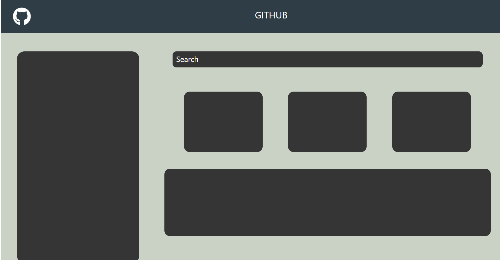

# 🖥️ github-profile

A simple **GitHub Dashboard UI Clone** built using **HTML, CSS, Bootstrap, and Font Awesome**.  
This project demonstrates how to design a clean and responsive layout that resembles GitHub’s interface.

---

## ✨ Features
- 📌 Responsive layout using **Bootstrap Grid System**.  
- 🎨 Styled components with **custom CSS**.  
- 🔍 Search bar design.  
- 📦 Sidebar navigation panel.  
- 📊 Dashboard boxes & content section.  
- 🎯 Font Awesome icons integration.  

---

## 📂 Project Structure
github-profile/
│── index.html
│── style.css
│── README.md
│── github-profile.png

---

## 🚀 Getting Started

### 🔹 Clone the Repository
```bash
git clone https://github.com/Elanthiran/github-profile.git
cd github-profile
```
---

🔹 Run the Project

Just open index.html in your browser.

---


## 📸 Screenshots



---

## 🛠️ Tech Stack
- HTML5

- CSS3

- Bootstrap 5

- Font Awesome
---

## 🚧 Future Improvements

 - Add interactive JavaScript functionality.

 - Create a dark/light mode toggle.

 - Add real GitHub API integration for repositories and user details.

 - Make it fully mobile responsive with advanced styling.

---

## 🤝 Contributing

- Contributions are welcome!

- Fork this repo

- Create a new branch (feature-xyz)

- Commit changes

- Submit a Pull Request

--- 

## 📜 License

This project is licensed under the MIT License – feel free to use and modify it.

